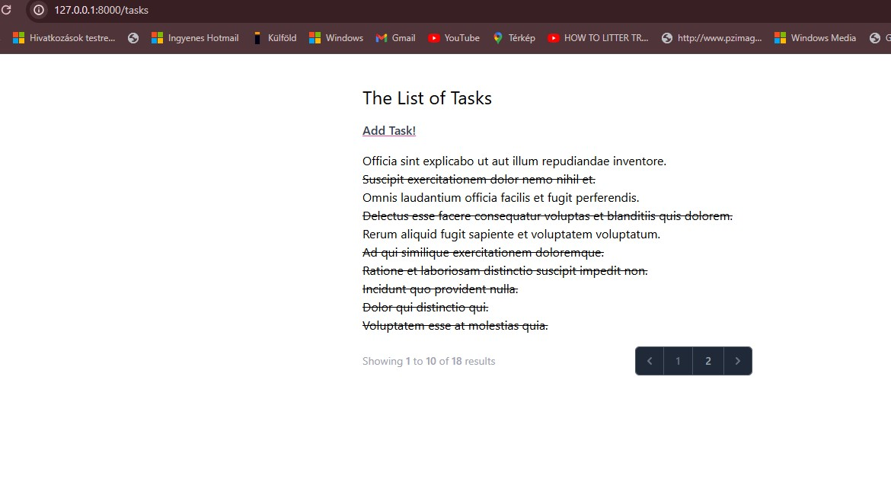

# Laravel 10 Task List

## Table of contents
* [General info](#general-info)
* [Description](#description)
* [Screenshot](#screenshot)
* [Technologies](#technologies)
* [Setup](#setup)
* [Documentation](#documentation)
* [Developer](#developer)
* [Status](#status)
* [Created](#created)
* [License](#license)

## General info

Task List application built with Laravel 10, providing a simple interface to manage daily tasks efficiently for [Master Laravel for Beginners & Intermediate 2024 Udemy Course](https://www.udemy.com/course/laravel-beginner-fundamentals/learn/lecture/38206406#overview).

## Description

The Laravel 10 Task List application allows users to create, update, and delete tasks. It offers a clean and user-friendly interface for managing daily tasks. The application is designed with simplicity and efficiency in mind.

## Screenshot



## Technologies

+ Laravel 10
+ PHP 8
+ MySQL
+ Tailwind
+ Docker
+ Blade Templates

## Setup

Clone the repository:

```bash
git clone git@github.com:ivorszaniszlo/l10-task-list.git
```

Navigate to the project directory:

```bash
cd l10-task-list
```

Install dependencies:

```bash
composer install
npm install
```

Set up environment variables:

```bash
cp .env.example .env
php artisan key:generate
```

Set up the database and run migrations:

```bash
php artisan migrate
```

Serve the application:

```bash
php artisan serve
```

### Docker Setup

Build and run the Docker containers:

```bash
docker-compose up --build
```

Access the application at `http://localhost:8000`.

## Documentation

Documentation is available in the `docs` directory.

## Created

2024

## License

MIT License
